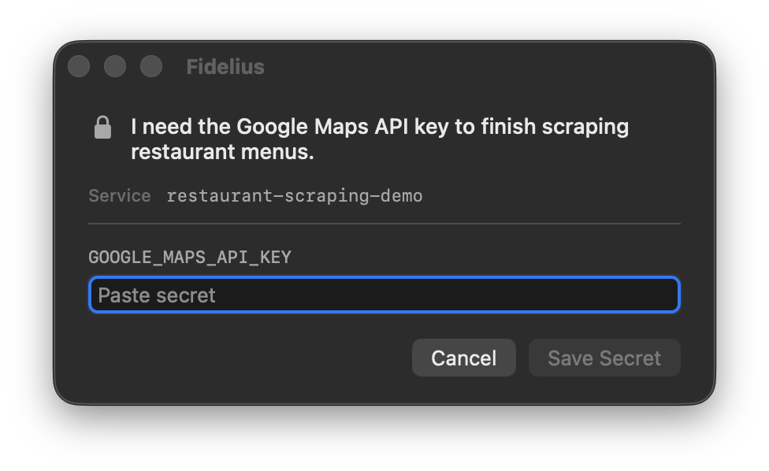

# Fidelius

**Fidelius is built for agents to ask humans for secrets.**

When an agent needs a credential, it runs one blocking command. Fidelius opens a small native macOS window, you paste the requested secret, and Fidelius saves it to macOS Keychain. The agent never needs you to open a terminal or paste the secret into chat.

<p align="center">
  
</p>

## Install

```bash
curl -fsSL https://fidelius.ashray.xyz/install.sh | bash
```

macOS 13 or newer. Apple Silicon and Intel are both supported.

## Example

An agent working on a restaurant-scraping project needs Google Maps access:

```bash
fidelius \
  -s restaurant-scraping-demo \
  -m "I need the Google Maps API key to finish scraping restaurant menus." \
  GOOGLE_MAPS_API_KEY
```

Fidelius waits while you provision the key, saves it when you press Enter, then returns only safe metadata to the agent.

The agent can use Apple's normal Keychain CLI afterward:

```bash
security find-generic-password \
  -s restaurant-scraping-demo \
  -a GOOGLE_MAPS_API_KEY \
  -w
```

Multiple secrets can be requested in one prompt, and multiple agents can open independent Fidelius windows at the same time.

Fidelius is intentionally not a secret manager. It only handles the human-to-Keychain handoff.

[Development and release notes →](DEVELOPMENT.md)

Apache-2.0
